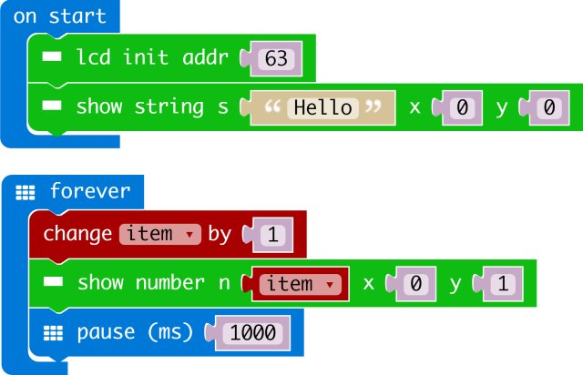

# i2cLCD1602

makecode I2C LCD1602 package for micro:bit  

Author: shaoziyang  
Date:   2021/1/25
  


## パッケージの追加

makecodeの拡張から

https://github.com/sakai-code/LCD1602
と検索してください（その他SET）より実行も可能

## 使い方の例

```
let item = 0
I2C_LCD1602.LcdInit(0)
I2C_LCD1602.ShowString("Hello", 0, 0)
basic.forever(() => {
    item += 1
    I2C_LCD1602.ShowNumber(item, 0, 1)
    basic.pause(1000)
})
```


## I2C Addressのアドレスの例 
- PCF8574: 39  
- PCF8574A: 63  
- Auto: 0

## API

- LcdInit(Addr: number)  
LCDの初期化、0で自動的に検索し適用します（初期値）

- ShowNumber(n: number, x: number, y: number)  
数字を表示します
n: 対象の数字
x:LCDのX軸の位置, [0 - 15]  
y:LCdのY軸の位置, [0 - 1]  

- ShowString(s: string, x: number, y: number)  
文字列を表示します、機能は数字と同じ

- on()  
LCDの起動

- off()  
LCDの電源OFF

- clear()  
画面のクリア

- BacklightOn()  
バックライトの点灯

- BacklightOff()  
バックライトの消灯

- shl()
左にシフト

- shr()
右にシフトします


## Demo



## License

MIT

Copyright (c) 2018, microbit/micropython Chinese community  

## Supported targets

* for PXT/microbit


[From microbit/micropython Chinese community](http://www.micropython.org.cn)
上記より日本語訳をしました。　
